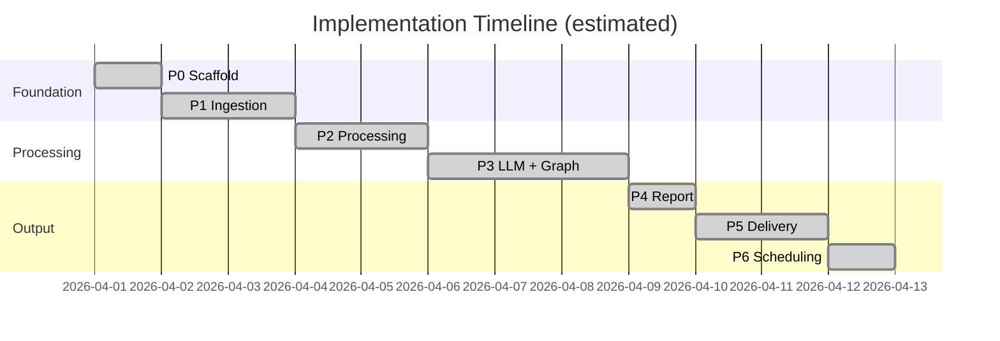

# Review Pulse — Phase-Wise Implementation Plan

> Derived from [architecture.md](./architecture.md)  
> **Product:** INDMoney only · **Stack:** 100% free-tier · **LLM:** Groq

This document breaks the build into seven phases (P0–P6). Each phase records the original plan, its completion status, and any implementation deviations from the original design.

**All phases are complete.** The project is fully operational.

---

## Overview



| Phase | Name | Status |
|---|---|---|
| P0 | Scaffold | ✅ Complete |
| P1 | Ingestion | ✅ Complete |
| P2 | Processing | ✅ Complete |
| P3 | LLM + Graph | ✅ Complete |
| P4 | Report Rendering | ✅ Complete |
| P5 | Delivery (MCP) | ✅ Complete |
| P6 | Scheduling & Hardening | ✅ Complete |

---

## Phase P0 — Scaffold ✅

### Objective

Establish project structure, dependency management, configuration loading, SQLite schema, and a CLI skeleton so all later phases plug into a consistent foundation.

### Completed Tasks

- Python project with `pyproject.toml` (Python 3.11+)
- Directory layout as defined in architecture §11
- `.gitignore` (`data/`, `.env`, `token.json`, `credentials.json`, `__pycache__/`, `.venv/`)
- `.env.example` with all documented environment variables
- `config/indmoney.yaml` with INDMoney product settings
- `src/review_pulse/config.py` — YAML + env loading via `pydantic-settings`
- `src/review_pulse/db/schema.sql` and `repository.py` — init DB, CRUD for `runs`, `reviews`, `themes`
- CLI in `__main__.py` using `typer`:
  - `run --product indmoney [--week ISO_WEEK] [--force] [--dry-run]`
  - `status --product indmoney [--week ISO_WEEK]`
  - `init-db`
- Core dataclasses: `Review`, `ThemeCluster`, `ReportDraft`, `ReportTheme`, `ReportQuote`, `RunMetrics`, `RunRecord`

### Files Created

```
pyproject.toml
.gitignore
.env.example
config/indmoney.yaml
README.md
src/review_pulse/__init__.py
src/review_pulse/__main__.py
src/review_pulse/config.py
src/review_pulse/logging.py
src/review_pulse/models.py
src/review_pulse/db/__init__.py
src/review_pulse/db/schema.sql
src/review_pulse/db/repository.py
data/.gitkeep
```

### Verification

```bash
pip install -e .
python -m review_pulse init-db
python -m review_pulse status --product indmoney
```

---

## Phase P1 — Ingestion ✅

### Objective

Fetch public INDMoney reviews from Google Play and Apple App Store for a configurable 10-week window, normalize them into the `Review` model, and apply basic cleaning and deduplication.

### Completed Tasks

- `src/review_pulse/ingest/google_play.py` — paginated scraping with `Sort.NEWEST`, 1.5 s delay between calls, safety cap at 10,000 reviews
- `src/review_pulse/ingest/app_store.py` — `app-store-scraper` wrapper with up to 3 retries and linear backoff
- `src/review_pulse/ingest/__init__.py` — `fetch_all_reviews(config, window_start, window_end)` aggregator
- `src/review_pulse/process/clean.py` — HTML unescape, zero-width char removal, whitespace normalization, SHA-256 deduplication, minimum 10-character filter
- Unit tests with fixture JSON (no live scraping in CI)

### Files Created

```
src/review_pulse/ingest/__init__.py
src/review_pulse/ingest/google_play.py
src/review_pulse/ingest/app_store.py
src/review_pulse/process/__init__.py
src/review_pulse/process/clean.py
tests/fixtures/google_play_sample.json
tests/fixtures/app_store_sample.json
tests/test_clean.py
tests/test_ingest.py
```

---

## Phase P2 — Processing ✅

### Objective

Scrub PII from review text, generate local embeddings, cluster reviews into themes, and persist cluster assignments — all without any paid API calls.

### Completed Tasks

- `src/review_pulse/process/pii.py` — regex patterns for email, Indian phone, PAN card, Aadhaar-like, and long digit sequences; all replaced with `[REDACTED]`
- `src/review_pulse/process/cluster.py` — `sentence-transformers/all-MiniLM-L6-v2` → `StandardScaler` → `KMeans` k ∈ [3, 8] with silhouette scoring
- Embedding cache to `data/embeddings/{run_id}.npy` for retry efficiency
- **Added beyond original plan:** TF-IDF fallback (`TfidfVectorizer`) automatically activated when `RENDER` environment variable is present or `LOW_RESOURCE_MODE=true`, to work within Render's free-tier memory constraints

### Files Created

```
src/review_pulse/process/pii.py
src/review_pulse/process/cluster.py
tests/test_pii.py
tests/test_cluster.py
```

---

## Phase P3 — LLM + LangGraph ✅

### Objective

Wire the full LangGraph state machine, integrate Groq for report generation, and validate quotes against source review text.

### Completed Tasks

- `src/review_pulse/graph/state.py` — `PulseState` TypedDict
- `src/review_pulse/llm/prompts.py` — system + user prompts with XML delimiters for prompt injection resistance
- `src/review_pulse/llm/groq_client.py` — Groq wrapper with retry, model fallback, and token tracking
- `src/review_pulse/validate/quotes.py` — `rapidfuzz.fuzz.token_set_ratio ≥ 90`
- All 10 graph nodes in `src/review_pulse/graph/nodes.py`
- `src/review_pulse/graph/builder.py` — `StateGraph` assembly with conditional quote validation retry loop (max 3 total attempts)
- CLI `run` command wired to invoke the compiled graph
- `--force` and `--dry-run` flags

### Deviations from Original Plan

| Item | Original Plan | Implementation |
|---|---|---|
| LLM SDK | `langchain-groq` / `ChatGroq` | Native `groq` SDK with `json.loads()` — simpler, fewer dependencies |
| JSON parsing | LangChain `JsonOutputParser` | `response_format={"type":"json_object"}` + `json.loads()` |
| Temperature | `0.2` | `0.3` |
| SQLite checkpointer | Planned | Not implemented — resumability handled via SQLite run records and `--force` |
| `langchain` / `langchain-groq` deps | In `pyproject.toml` | Listed but unused — can be removed in a future cleanup |

### Files Created

```
src/review_pulse/graph/__init__.py
src/review_pulse/graph/state.py
src/review_pulse/graph/nodes.py
src/review_pulse/graph/builder.py
src/review_pulse/llm/__init__.py
src/review_pulse/llm/groq_client.py
src/review_pulse/llm/prompts.py
src/review_pulse/validate/__init__.py
src/review_pulse/validate/quotes.py
tests/test_quotes.py
tests/test_graph.py
```

---

## Phase P4 — Report Rendering ✅

### Objective

Convert validated LLM JSON output into a one-page Markdown report and persist it to disk.

### Completed Tasks

- `src/review_pulse/render/markdown.py` — full markdown renderer with header, executive summary, top themes, representative quotes, action ideas, and footer
- `render_report` graph node connected to renderer
- Report written to `data/reports/{slug}-{week_start_date}.md`
- `runs.report_path` updated in SQLite after render
- Snapshot tests for report structure

### Files Created

```
src/review_pulse/render/__init__.py
src/review_pulse/render/markdown.py
tests/test_render.py
tests/snapshots/
```

---

## Phase P5 — Delivery (Google Workspace MCP Server) ✅

### Objective

Deliver the rendered report to Google Docs and optionally create a Gmail draft via a separately running Google MCP server.

### Completed Tasks

- `src/review_pulse/deliver/mcp_client.py` — `httpx`-based HTTP client with:
  - Correlation IDs (`X-Request-ID`) on every request
  - Fine-grained exception handling (ConnectTimeout, ConnectError, ReadTimeout, HTTPStatusError)
  - Conservative retry logic: retries on `ConnectError`, `ConnectTimeout`, and HTTP 502/503/504; does NOT retry on `ReadTimeout` to prevent duplicate writes
  - Exponential backoff (capped at 30 s)
  - Payload validation with explicit `ValueError` (not `assert`)
- `deliver_report` graph node connected to MCP client
- `--dry-run` flag skips all MCP calls
- Full unit test suite with mocked `httpx.post`

### Deviations from Original Plan

| Item | Original Plan | Implementation |
|---|---|---|
| Google API location | `deliver/google_docs.py` + `deliver/gmail.py` in this repo | Moved to a separate `google-mcp-server` project; this repo only contains the HTTP client |
| Google API libraries | `google-api-python-client`, `google-auth-oauthlib`, `google-auth-httplib2` | Not in this repo — they live in the google-mcp-server project |
| `Approve? (y/n)` prompt | Terminal prompt in this process | Handled by the google-mcp-server process |

The MCP server design decouples OAuth credential management from the pipeline and enables human-in-the-loop approval without blocking the pipeline process.

### Files Created

```
src/review_pulse/deliver/mcp_client.py
tests/test_deliver.py
```

---

## Phase P6 — Scheduling & Hardening ✅

### Completed Tasks

- `src/review_pulse/logging.py` — JSON stdout formatter + rotating file handler (5 MB, 3 backups)
- Week resolution logic in `config.py`: current ISO week by default, configurable via `--week`
- Review window: `REVIEW_WINDOW_WEEKS` (default 10) weeks ending on run date
- Stale `running` status auto-recovery: runs started > 1 hour ago are treated as stale on next `run` command
- `status` command showing last 5 runs with full audit detail
- `.github/workflows/weekly-pulse.yml` — scheduled Monday 03:30 UTC, manual dispatch with `week` and `force` inputs, pip + Hugging Face model caching

**GitHub Actions note:** The workflow always runs in `--dry-run` mode because the google-mcp-server is not available in the CI environment. Markdown reports are generated and logged to SQLite, but no Google Doc is updated and no Gmail draft is created.

- `src/review_pulse/api.py` — **Added beyond original plan** — FastAPI REST API wrapping the pipeline for frontend and Render deployment:
  - `POST /api/runs` — trigger a run
  - `GET /api/runs/{product}` — list recent runs
  - `GET /api/runs/{run_id}/status` — poll run status
  - `GET /api/runs/{run_id}/report` — fetch markdown report
  - `GET /api/themes/{run_id}` — fetch LLM themes
  - `GET /api/debug/mcp` — diagnostic connectivity check
  - `X-API-Key` auth middleware (opt-in via `API_KEY` env var)
  - `ThreadPoolExecutor` (2 workers) for non-blocking background pipeline execution
- `render.yaml` — Render deployment config with persistent 1 GB disk for SQLite and reports

### Files Created

```
src/review_pulse/api.py
src/review_pulse/logging.py      (moved here from P0 partial)
.github/workflows/weekly-pulse.yml
render.yaml
docs/runbook.md
docs/deployment-plan.md
```

---

## Dependency Summary (actual `pyproject.toml`)

```toml
[project]
dependencies = [
  # P0 — Scaffold
  "pydantic>=2.0",
  "pydantic-settings>=2.0",
  "pyyaml>=6.0",
  "python-dotenv>=1.0",
  "typer>=0.12",
  # P1 — Ingestion
  "google-play-scraper>=1.2",
  "app-store-scraper>=0.3",
  # P2 — Processing
  "sentence-transformers>=3.0",
  "scikit-learn>=1.4",
  "numpy>=1.26",
  "langdetect>=1.0.9",
  # P3 — LLM + Graph
  "langgraph>=0.2",
  "langchain>=0.3",      # listed; not actively used — native groq SDK used instead
  "langchain-groq>=0.2", # listed; not actively used — native groq SDK used instead
  "rapidfuzz>=3.0",
  "groq>=0.9",           # native Groq SDK used for LLM calls
  # P5 — Delivery
  "httpx>=0.24",
  # API / Deployment
  "fastapi>=0.100.0",
  "uvicorn>=0.20.0",
]

[project.optional-dependencies]
dev = ["pytest>=8.0", "pytest-asyncio>=0.23"]
```

> **Note:** `langchain` and `langchain-groq` are listed in `pyproject.toml` but are not imported anywhere in the codebase. The LLM integration uses the native `groq` SDK directly. These can be removed in a future dependency cleanup.

---

## Credentials Checklist

| Credential | Phase | Status |
|---|---|---|
| Groq API key (`GROQ_API_KEY`) | P3 | Required — obtain free at [console.groq.com/keys](https://console.groq.com/keys) |
| Google OAuth `credentials.json` | P5 | Lives on google-mcp-server only; not required in this repo |
| Google OAuth `token.json` | P5 | Lives on google-mcp-server only; generated once via browser auth |
| `EMAIL_RECIPIENTS` | P5 | Optional; Gmail draft skipped if not set |
| `GOOGLE_DOC_ID` | P5 | Optional; Google Docs append skipped if not set |
| `API_KEY` | P6 | Optional; REST API is open if not set |

---

## End-to-End Smoke Test Checklist

Run after a clean install to validate the full system:

- [ ] `pip install -e .` succeeds cleanly
- [ ] `python -m review_pulse init-db` creates `data/review_pulse.db`
- [ ] `.env` has valid `GROQ_API_KEY`
- [ ] `python -m review_pulse run --product indmoney --week 2026-W14 --dry-run` completes with `status=completed`
- [ ] `data/reports/indmoney-2026-04-06.md` exists and contains all five sections
- [ ] Re-run without `--force` skips cleanly: `skip=True`
- [ ] `python -m review_pulse status --product indmoney` shows correct metrics
- [ ] `pytest tests/ -v` — all tests pass
- [ ] (With MCP server running) `python -m review_pulse run --product indmoney --force` updates Google Doc and creates Gmail draft
