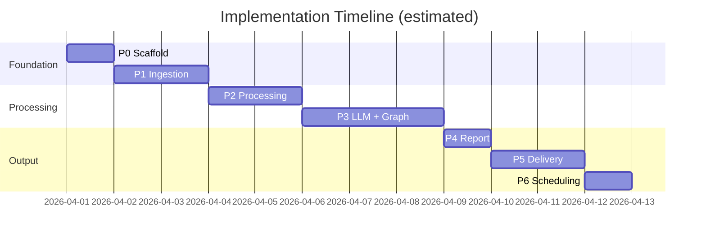

# Review Pulse — Phase-Wise Implementation Plan

> Derived from [architecture.md](./architecture.md)  
> **Product:** INDMoney only · **Stack:** 100% free-tier · **LLM:** Groq

This document breaks the build into seven phases (P0–P6). Each phase has clear tasks, deliverables, acceptance criteria, and verification steps. Complete phases in order; later phases depend on earlier ones.

---

## Overview




| Phase | Name        | Est. effort | Blockers             |
| ----- | ----------- | ----------- | -------------------- |
| P0    | Scaffold    | 0.5–1 day   | None                 |
| P1    | Ingestion   | 1–2 days    | None                 |
| P2    | Processing  | 1–2 days    | P1                   |
| P3    | LLM + Graph | 2–3 days    | P2, **GROQ_API_KEY** |
| P4    | Report      | 0.5–1 day   | P3                   |
| P5    | Delivery    | 1–2 days    | P4, **Google OAuth** |
| P6    | Scheduling  | 0.5–1 day   | P5                   |


**Total estimated effort:** 7–12 days for a single developer.

---

## Phase P0 — Scaffold

### Objective

Establish project structure, dependency management, configuration loading, SQLite schema, and a CLI skeleton so all later phases plug into a consistent foundation.

### Tasks

- [ ] Initialize Python project with `pyproject.toml` (Python 3.11+)
- [ ] Create directory layout per architecture §10
- [ ] Add `.gitignore` (`data/`, `.env`, `token.json`, `credentials.json`, `__pycache__/`, `.venv/`)
- [ ] Add `.env.example` with all documented env vars
- [ ] Create `config/indmoney.yaml` with INDMoney product settings
- [ ] Implement `src/review_pulse/config.py` — load YAML + env via `pydantic-settings`
- [ ] Implement `src/review_pulse/db/schema.sql` and `repository.py` — init DB, CRUD for `runs`
- [ ] Implement CLI skeleton in `__main__.py` using `argparse` or `typer`:
  - `run --product indmoney [--week ISO_WEEK] [--force]`
  - `status --product indmoney [--week ISO_WEEK]`
  - `init-db`
- [ ] Add core dataclasses: `Review`, `ThemeCluster`, `ReportDraft`, `RunMetrics`
- [ ] Write minimal `README.md` with setup instructions

### Files to create

```
pyproject.toml
.gitignore
.env.example
config/indmoney.yaml
README.md
src/review_pulse/__init__.py
src/review_pulse/__main__.py
src/review_pulse/config.py
src/review_pulse/models.py
src/review_pulse/db/schema.sql
src/review_pulse/db/repository.py
data/.gitkeep
```

### Dependencies (pyproject.toml)

```toml
[project]
dependencies = [
  "pydantic>=2.0",
  "pydantic-settings>=2.0",
  "pyyaml>=6.0",
  "python-dotenv>=1.0",
  "typer>=0.12",
]
```

### Acceptance criteria

1. `python -m review_pulse init-db` creates `data/review_pulse.db` with `runs`, `reviews`, `themes` tables.
2. `python -m review_pulse run --product indmoney` exits cleanly with a "not implemented" or stub message (no crash).
3. `config/indmoney.yaml` loads correctly; missing env vars produce clear error messages.
4. Project installs in editable mode: `pip install -e .`

### Verification

```bash
python -m venv .venv && source .venv/bin/activate
pip install -e .
python -m review_pulse init-db
python -m review_pulse status --product indmoney
```

---

## Phase P1 — Ingestion

### Objective

Fetch public INDMoney reviews from Google Play and Apple App Store for a configurable 8–12 week window, normalize them into the `Review` model, and apply basic cleaning + deduplication.

### Tasks

- [ ] Add ingestion dependencies: `google-play-scraper`, `app-store-scraper`
- [ ] Implement `src/review_pulse/ingest/google_play.py`
  - Paginate reviews with `Sort.NEWEST`
  - Filter by date window (`week_start` → `week_end`)
  - Map to normalized `Review` objects
  - 1–2 s delay between pagination calls
- [ ] Implement `src/review_pulse/ingest/app_store.py`
  - Fetch reviews for app ID `1450178837`, country `in`
  - Same date filtering and normalization
- [ ] Implement `src/review_pulse/ingest/__init__.py` — unified `fetch_all_reviews(config, window)` aggregator
- [ ] Implement `src/review_pulse/process/clean.py`
  - Strip HTML entities, zero-width chars
  - Collapse whitespace
  - Dedupe via `sha256(normalized_text + rating + review_date)`
  - Drop reviews < 10 chars or outside window
- [ ] Persist fetched + cleaned reviews to SQLite (`reviews` table)
- [ ] Add unit tests with fixture JSON (no live scraping in CI)

### Files to create / modify

```
src/review_pulse/ingest/__init__.py
src/review_pulse/ingest/google_play.py
src/review_pulse/ingest/app_store.py
src/review_pulse/process/clean.py
tests/fixtures/google_play_sample.json
tests/fixtures/app_store_sample.json
tests/test_clean.py
tests/test_ingest.py
```

### Acceptance criteria

1. Running ingestion for INDMoney returns reviews from **both** Google Play and App Store.
2. Reviews outside the 8–12 week window are excluded.
3. Duplicate reviews (same text + rating + date) appear only once.
4. At least 50 reviews fetched in a live test (volume varies by week).
5. Review records stored in SQLite with correct `source`, `rating`, `review_date`.

### Verification

```bash
# One-off script or CLI subcommand
python -c "
from review_pulse.config import load_config
from review_pulse.ingest import fetch_all_reviews
from review_pulse.process.clean import clean_and_deduplicate
from datetime import date, timedelta

cfg = load_config('indmoney')
end = date.today()
start = end - timedelta(weeks=10)
raw = fetch_all_reviews(cfg, start, end)
clean = clean_and_deduplicate(raw, start, end)
print(f'Fetched: {len(raw)}, Clean: {len(clean)}')
"
```

### Risks & mitigations


| Risk                        | Mitigation                                       |
| --------------------------- | ------------------------------------------------ |
| Scraper library breaking    | Pin versions; add retry with exponential backoff |
| App Store throttling        | Limit `how_many`; add delays                     |
| Low review volume in window | Log warning; proceed with available data         |


---

## Phase P2 — Processing

### Objective

Scrub PII from review text, generate local embeddings, cluster reviews into themes, and persist cluster assignments — all without any paid API calls.

### Tasks

- [ ] Implement `src/review_pulse/process/pii.py`
  - Regex patterns: email, phone (IN), PAN, Aadhaar-like, long digit sequences
  - Replace matches with `[REDACTED]`
  - Unit tests for each pattern
- [ ] Implement `src/review_pulse/process/cluster.py`
  - Load `sentence-transformers/all-MiniLM-L6-v2` (lazy init, cache model)
  - Embed cleaned review texts → 384-dim vectors
  - `StandardScaler` → `KMeans` with k ∈ [3, 8]
  - Select k with best silhouette score
  - Compute per-cluster: `review_count`, `avg_rating`, sample texts
  - Persist cluster assignments to SQLite (`themes` table, `reviews.cluster_id`)
- [ ] Add optional `langdetect` filter (skip non-English if confidence > 0.9)
- [ ] Cache embeddings to `data/embeddings/{run_id}.npy` for retry efficiency

### Dependencies to add

```toml
"sentence-transformers>=3.0",
"scikit-learn>=1.4",
"numpy>=1.26",
"langdetect>=1.0.9",
```

### Files to create

```
src/review_pulse/process/pii.py
src/review_pulse/process/cluster.py
tests/test_pii.py
tests/test_cluster.py
```

### Acceptance criteria

1. Known PII strings (email, phone, PAN) are redacted before any downstream step.
2. Reviews cluster into 3–8 groups with silhouette score logged.
3. Each cluster has `review_count`, `avg_rating`, and assigned `cluster_id` in DB.
4. Embedding + clustering for 400 reviews completes in < 120 s on CPU.
5. No external API calls during this phase.

### Verification

```bash
pytest tests/test_pii.py tests/test_cluster.py -v

# Integration smoke test
python -c "
from review_pulse.process.pii import scrub_pii
from review_pulse.process.cluster import cluster_reviews
assert '[REDACTED]' in scrub_pii('Contact me at test@example.com')
print('PII scrub OK')
"
```

### Risks & mitigations


| Risk                             | Mitigation                                            |
| -------------------------------- | ----------------------------------------------------- |
| First run downloads ~90 MB model | Document one-time download; cache in `~/.cache/torch` |
| Too few reviews for clustering   | Fall back to k=1; log warning; still proceed to LLM   |


---

## Phase P3 — LLM + LangGraph

### Objective

Wire the full LangGraph state machine, integrate Groq for report generation, and validate quotes against source review text. This is the core AI agent.

### Prerequisites

- **GROQ_API_KEY** required — obtain free at [console.groq.com/keys](https://console.groq.com/keys)
- Phases P0–P2 complete

### Tasks

- [ ] Add LangGraph + Groq dependencies:
  ```toml
  "langgraph>=0.2",
  "langchain>=0.3",
  "langchain-groq>=0.2",
  "rapidfuzz>=3.0",
  ```

- [ ] Implement `src/review_pulse/graph/state.py` — `PulseState` TypedDict
- [ ] Implement `src/review_pulse/llm/prompts.py` — system + user prompts with XML delimiters
- [ ] Implement `src/review_pulse/llm/groq_client.py`
  - `ChatGroq` wrapper with model `llama-3.3-70b-versatile`
  - Fallback to `llama-3.1-8b-instant`
  - Exponential backoff on HTTP 429 (`retry-after` header)
  - Token usage tracking → `RunMetrics.groq_tokens_used`
- [ ] Implement graph nodes in `src/review_pulse/graph/nodes.py`:

  | Node                | Implementation                                                         |
  | ------------------- | ---------------------------------------------------------------------- |
  | `check_idempotency` | Query `runs` table; short-circuit if completed                         |
  | `fetch_reviews`     | Call P1 ingest                                                         |
  | `clean_reviews`     | Call P1 clean                                                          |
  | `scrub_pii`         | Call P2 pii                                                            |
  | `embed_and_cluster` | Call P2 cluster                                                        |
  | `generate_report`   | Groq → structured JSON (`themes`, `quotes`, `action_ideas`, `summary`) |
  | `validate_quotes`   | Call quote validator                                                   |
  | `render_report`     | Stub → fully implemented in P4                                         |
  | `deliver_report`    | Stub → fully implemented in P5                                         |
  | `audit_log`         | Write run record + metrics to SQLite                                   |


- [ ] Implement `src/review_pulse/validate/quotes.py`
  - `rapidfuzz.fuzz.token_set_ratio` ≥ 90 against cluster reviews
  - Return `{valid: bool, failed_quotes: list}`
- [ ] Implement `src/review_pulse/graph/builder.py`
  - Assemble `StateGraph` with conditional edge: `validate_quotes` → retry `generate_report` (max 2) or proceed
  - SQLite checkpointer for resumability
- [ ] Wire CLI `run` command to invoke the graph
- [ ] Add `--force` flag to bypass idempotency check

### Files to create

```
src/review_pulse/graph/__init__.py
src/review_pulse/graph/state.py
src/review_pulse/graph/nodes.py
src/review_pulse/graph/builder.py
src/review_pulse/llm/__init__.py
src/review_pulse/llm/groq_client.py
src/review_pulse/llm/prompts.py
src/review_pulse/validate/__init__.py
src/review_pulse/validate/quotes.py
tests/test_quotes.py
tests/test_graph.py
```

### Acceptance criteria

1. Full graph runs end-to-end (through `audit_log`) with stub render/deliver nodes.
2. Groq returns structured JSON with themes, quotes, action ideas, and summary.
3. All quotes pass fuzzy validation (score ≥ 90) or are retried/dropped with audit log entry.
4. Re-running same `(product, week_start)` skips execution unless `--force`.
5. Failed run sets `runs.status = 'failed'` with `error_message`.
6. Total Groq usage per run ≤ 4 calls and ~10,000 tokens.
7. Prompt injection strings in review text do not alter report structure.

### Verification

```bash
# Set GROQ_API_KEY in .env first
python -m review_pulse run --product indmoney --week 2026-W14

# Confirm idempotency
python -m review_pulse run --product indmoney --week 2026-W14  # should skip

# Confirm force re-run
python -m review_pulse run --product indmoney --week 2026-W14 --force

python -m review_pulse status --product indmoney --week 2026-W14
pytest tests/test_quotes.py tests/test_graph.py -v
```

### Risks & mitigations


| Risk                    | Mitigation                                        |
| ----------------------- | ------------------------------------------------- |
| Groq rate limit (429)   | Backoff + fallback model                          |
| LLM hallucinated quotes | Quote validator + max 2 retries + drop on failure |
| JSON parse errors       | `JsonOutputParser` with repair prompt             |


---

## Phase P4 — Report Rendering

### Objective

Convert validated LLM JSON output into a polished one-page Markdown report matching the INDMoney sample format, and persist it to disk.

### Tasks

- [ ] Implement `src/review_pulse/render/markdown.py`
  - Template from architecture §7.7
  - Sections: header, executive summary, top themes, quotes, action ideas, footer
  - Format quotes with rating, source, date metadata
  - Limit output to `max_themes`, `max_quotes_per_theme`, `max_action_ideas` from config
- [ ] Connect `render_report` graph node to markdown renderer
- [ ] Write report to `data/reports/indmoney-{ISO_WEEK}.md`
- [ ] Update `runs.report_path` in SQLite after render
- [ ] Add snapshot test comparing output structure against expected sections

### Files to create

```
src/review_pulse/render/__init__.py
src/review_pulse/render/markdown.py
tests/test_render.py
tests/snapshots/sample_report.md
```

### Acceptance criteria

1. Report file created at `data/reports/indmoney-{week}.md` after each successful run.
2. Report contains all five sections: Executive Summary, Top Themes, Representative Quotes, Action Ideas, footer.
3. Theme entries include review count and average rating.
4. Quote entries include source platform and date.
5. Report is readable in < 2 minutes by a product manager (concise, one page).

### Verification

```bash
python -m review_pulse run --product indmoney --week 2026-W14 --force
cat data/reports/indmoney-2026-W14.md
pytest tests/test_render.py -v
```

---

## Phase P5 — Delivery (Google Workspace MCP Server)

### Objective

Deliver the rendered report via Google Docs and optionally email stakeholders through Gmail by integrating with a separately running Google MCP (Model Context Protocol) style REST server.

### Prerequisites

- Running Google MCP Server instance at `http://localhost:8000`
- Configured recipients list in settings

### Tasks

- [ ] Add `httpx` to `pyproject.toml` dependencies
- [ ] Implement `google-mcp-server/` subproject:
  - `google-mcp-server/auth.py`: Google OAuth consent / token management
  - `google-mcp-server/docs_tool.py`: Append content to Google Doc using `docs_service`
  - `google-mcp-server/gmail_tool.py`: Create draft/send message in Gmail
  - `google-mcp-server/server.py`: FastAPI server with POST endpoints `/append_to_doc` and `/create_email_draft`, featuring terminal approval prompting `Approve? (y/n)`
  - `google-mcp-server/requirements.txt` and `README.md`
- [ ] Implement `src/review_pulse/deliver/mcp_client.py` in `review-pulse` to communicate with the MCP server
- [ ] Connect `deliver_report` graph node in `review-pulse` to call the MCP client endpoints
- [ ] Add unit tests for the MCP client communication using mocked HTTP requests (via `respx` or mock)

### Files to create / modify

```
google-mcp-server/server.py
google-mcp-server/auth.py
google-mcp-server/docs_tool.py
google-mcp-server/gmail_tool.py
google-mcp-server/requirements.txt
google-mcp-server/README.md
src/review_pulse/deliver/mcp_client.py
tests/test_deliver.py
```

### Acceptance criteria

1. FastAPI endpoints `/append_to_doc` and `/create_email_draft` function correctly on the server.
2. Terminal user must approve each action: `Approve? (y/n)` printed to standard output.
3. Re-running the pipeline updates the same Google Doc or draft without duplicates.
4. `--dry-run` bypasses all MCP HTTP requests.
5. Unit tests mock HTTP communication and verify delivery node behavior.


---

## Phase P6 — Scheduling & Hardening

### Objective

Automate weekly runs, finalize idempotency guarantees, add structured logging, and document operational runbook.

### Tasks

- [ ] Add structured JSON logging to stdout (`run_id`, phase, duration, counts)
- [ ] Optional rotating file logs in `data/logs/`
- [ ] Implement week resolution logic:
  - Default: current ISO week
  - Review window: `REVIEW_WINDOW_WEEKS` (default 10) ending on run date
- [ ] Create cron entry or document setup:
  ```cron
  0 9 * * 1 cd /path/to/review-pulse && .venv/bin/python -m review_pulse run --product indmoney
  ```

- [ ] (Optional) Add `.github/workflows/weekly-pulse.yml` for GitHub Actions scheduling
  - Secrets: `GROQ_API_KEY`, `GOOGLE_TOKEN_JSON`, `EMAIL_RECIPIENTS`
  - Cache pip dependencies + sentence-transformers model
- [ ] Harden error handling:
  - Partial failure recovery via LangGraph checkpointer
  - `--force` clears stale `running` status older than 1 hour
- [ ] Add `python -m review_pulse status --product indmoney` — show last 5 runs
- [ ] Finalize README with: setup, env vars, cron, troubleshooting, cost summary ($0)
- [ ] End-to-end smoke test checklist

### Files to create / modify

```
.github/workflows/weekly-pulse.yml   # optional
src/review_pulse/logging.py
README.md                            # finalize
docs/runbook.md                      # operational guide
```

### Acceptance criteria

1. Cron/GitHub Actions triggers weekly run without manual intervention.
2. Structured logs emitted for each graph node with timing.
3. `status` command shows run history with counts and delivery status.
4. Re-running same week never creates duplicate reports, Docs, or emails.
5. Stale `running` status auto-recovered on next `--force` run.
6. Full E2E test passes: ingest → cluster → LLM → render → deliver → audit.

### Verification

```bash
# Simulate scheduled run
python -m review_pulse run --product indmoney

# Check audit trail
python -m review_pulse status --product indmoney

# Verify no duplicates after double run
python -m review_pulse run --product indmoney
python -m review_pulse run --product indmoney  # must skip

# Inspect logs
cat data/logs/review-pulse.log | tail -20
```

---

## End-to-End Smoke Test Checklist

Run once after P6 to validate the full system:

- [ ] `pip install -e .` succeeds
- [ ] `python -m review_pulse init-db` creates database
- [ ] `.env` has valid `GROQ_API_KEY`
- [ ] Google OAuth token valid (`token.json`)
- [ ] `python -m review_pulse run --product indmoney --week 2026-W14` completes with `status=completed`
- [ ] `data/reports/indmoney-2026-W14.md` exists and is readable
- [ ] Google Doc created/updated (link in audit log)
- [ ] Email received by stakeholders (if configured)
- [ ] Re-run without `--force` skips cleanly
- [ ] `python -m review_pulse status --product indmoney` shows correct metrics
- [ ] All pytest tests pass: `pytest tests/ -v`

---

## Credentials Checklist


| Credential                      | Phase | Status                       |
| ------------------------------- | ----- | ---------------------------- |
| Groq API key (`GROQ_API_KEY`)   | P3    | ⬜ Required before P3         |
| Google OAuth `credentials.json` | P5    | ⬜ Required before P5         |
| Google OAuth `token.json`       | P5    | ⬜ Generated via setup script |
| `EMAIL_RECIPIENTS`              | P5    | ⬜ Optional but recommended   |


---

## Dependency Summary (all phases)

```toml
[project]
dependencies = [
  # P0
  "pydantic>=2.0",
  "pydantic-settings>=2.0",
  "pyyaml>=6.0",
  "python-dotenv>=1.0",
  "typer>=0.12",
  # P1
  "google-play-scraper>=1.2",
  "app-store-scraper>=0.3",
  # P2
  "sentence-transformers>=3.0",
  "scikit-learn>=1.4",
  "numpy>=1.26",
  "langdetect>=1.0.9",
  # P3
  "langgraph>=0.2",
  "langchain>=0.3",
  "langchain-groq>=0.2",
  "rapidfuzz>=3.0",
  # P5
  "google-api-python-client>=2.100",
  "google-auth-oauthlib>=1.2",
  "google-auth-httplib2>=0.2",
]

[project.optional-dependencies]
dev = ["pytest>=8.0", "pytest-asyncio>=0.23"]
```

---

## What to Build Next

Start with **P0 (Scaffold)** — no external credentials needed. When P2 is complete, share your **Groq API key** to begin P3.

```bash
# Ready to start?
pip install -e ".[dev]"
python -m review_pulse init-db
```

